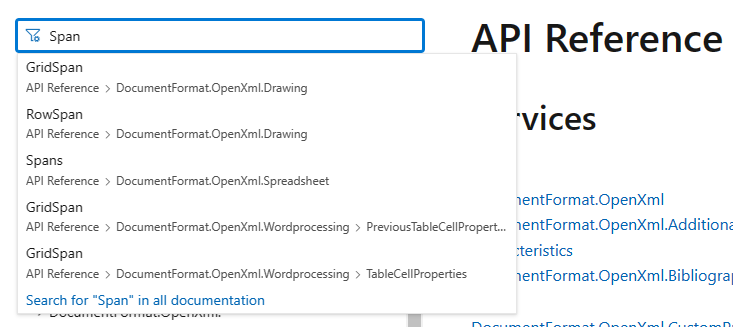

# Research Notes

* [Abstraction Strategy](#abstraction-strategy)
* [API Documentation Epiphany](#api-documentation-epiphany)
* [Default and Named Styles](#default-and-named-styles)
* [Image Metadata](#image-metadata)

## Abstraction Strategy
[Back to Top](#research-notes)  

> In progress, check back soon!
>
> I've started to iron out a strategy for abstracting complex API interactions into my own API. Check out the infrastructure in the [`Models`](./OpenXmlDocs/Models) and [`Extensions`](./OpenXmlDocs/Extensions) directories. The next step will be to build more robust classes and methods that allow for a more LINQ-style API vs. the current onion method call approach.

## API Documentation Epiphany
[Back to Top](#research-notes)

Working through understandning the OpenXML library has really opened my eyes to how important it is for an API to be intuitive and that you don't have to document everything. If your documentation does an adequate job of orienting you to how the API works, then you should be able to intuitively figure out what you need to accomplish for most given tasks thereafter. What follows is an example of this approach.

I was writing out the things that I need to figure out for a document build that I'm working on, and started considering how I might just implement an entire grid system as the foundation for a layout section within the document (similar to how CSS frameworks use grid systems). However, the idea of spanning columns was not mentioned in any of the articles on building tables (at the time of this writing!). After having encountered many similar situations the day before, I thought through the process that developed to find strategies for these situations.

In the [API Reference](https://docs.microsoft.com/en-us/dotnet/api/overview/openxml/?view=openxml-2.8.1), I searched the term *Span* and came up with many entries:



I've learned that since I'm working specifically with **Wordprocessing**, the [`GridSpan`](https://docs.microsoft.com/en-us/dotnet/api/documentformat.openxml.wordprocessing.tablecellproperties.gridspan?view=openxml-2.8.1) property of the [`TableCellProperties`](https://docs.microsoft.com/en-us/dotnet/api/documentformat.openxml.wordprocessing.tablecellproperties?view=openxml-2.8.1) class should be the result relevant to what I'm looking for:


> Note that in the **Definition** of the property, it indicates that it represents the element tag in the schema `w:gridSpan`. This is a very important piece of information that will be explored shortly!

At a glance, the details of this property may not seem to contain much information (particularly if you are not properly acclimated to how this API works). Given the information here (and not knowing anything about what a `w:gridSpan` element tag is), I moved up to the `TableCellProperties` class overview to see if I could definitely find if this `GridSpan` properly related to allowing a cell to span columns. The overview pages for the classes in this API provide a wealth of information and are incredibly helpful in finding what you need to accomplish a task. In this case, it allowed me to verify that `GridSpan` is what I need to enable cells to span columns:


Back to my comment about the `w:gridSpan` element tag, the biggest thing to understand about this library is that it's essentially building out XML-based documents. It is built to the [Office Open XML specification](http://officeopenxml.com/), which has been adopted by the ECMA International, as well as the ISO/IEC. Knowing that the `GridSpan` class gets translated into a `w:gridSpan` element tag, the exact details can be found in the specification's [Wordprocessing Tables - Cell Properties](http://officeopenxml.com/WPtableCellProperties.php) section:


Armed with this knowledge, I was able to test out this property by adding a row to the three-column table generated in the demo app associated with this repository. Note the `TableCellProperties` configuration in the definition of the `tr2 TableRow`:

**BuildDocumentTable**  

```cs
static bool BuildDocumentTable(string path)
{
    using var file = WordprocessingDocument.Open(path, true);
    var body = file.MainDocumentPart?.Document.Body;

    if (body is not null)
    {
        var tbl = new Table();
        var tblProps = new TableProperties();
        var tblStyle = new TableStyle { Val = "TableGrid" };
        // make the table width 100% of the page width.
        var tblWidth = new TableWidth { Width = "5000", Type = TableWidthUnitValues.Pct };
        var tg = new TableGrid(new GridColumn(), new GridColumn(), new GridColumn());

        tblProps.Append(tblStyle, tblWidth);
        tbl.Append(tblProps, tg);

        var tr1 = new TableRow(
            new TableCell(
                new Paragraph(new Run(new Text("Justified Left")))
            ),
            new TableCell(
                new Paragraph(
                    new ParagraphProperties(new Justification
                    {
                        Val = JustificationValues.Center
                    }),
                    new Run(new Text("Justified Center"))
                )
            ),
            new TableCell(
                new Paragraph(
                    new ParagraphProperties(new Justification
                    {
                        Val = JustificationValues.End
                    }),
                    new Run(new Text("Justified Right"))
                )
            )
        );

        var tr2 = new TableRow(
            new TableCell(
                new TableCellProperties(
                    new GridSpan() { Val = 3 }
                ),
                new Paragraph(
                    new ParagraphProperties(
                        new Justification()
                        {
                            Val = JustificationValues.Center
                        }
                    ),
                    new Run(new Text("A long block of text that will span all three columns of the table!"))
                )
            )
        );

        tbl.Append(tr1, tr2);
        body.AppendChild(tbl);

        return true;
    }
    else return false;
}
```

Execution of this method renders the following table in a Word document:


In order to see the XML that was generated, change the file extension for the document from `.docx` to `.zip` and open `{doc}.zip/word/document.xml`, where `{doc}` is the name of the generated document:

```xml
<w:tbl>
    <w:tblPr>
        <w:tblStyle w:val="TableGrid" />
        <w:tblW w:w="5000" w:type="pct" />
    </w:tblPr>
    <w:tblGrid>
        <w:gridCol />
        <w:gridCol />
        <w:gridCol />
    </w:tblGrid>
    <w:tr>
        <w:tc>
            <w:p>
                <w:r>
                    <w:t>Justified Left</w:t>
                </w:r>
            </w:p>
        </w:tc>
        <w:tc>
            <w:p>
                <w:pPr>
                    <w:jc w:val="center" />
                </w:pPr>
                <w:r>
                    <w:t>Justified Center</w:t>
                </w:r>
            </w:p>
        </w:tc>
        <w:tc>
            <w:p>
                <w:pPr>
                    <w:jc w:val="end" />
                </w:pPr>
                <w:r>
                    <w:t>Justified Right</w:t>
                </w:r>
            </w:p>
        </w:tc>
    </w:tr>
    <w:tr>
        <w:tc>
            <w:tcPr>
                <w:gridSpan w:val="3" />
            </w:tcPr>
            <w:p>
                <w:pPr>
                    <w:jc w:val="center" />
                </w:pPr>
                <w:r>
                    <w:t>A long block of text that will span all three columns of the table!</w:t>
                </w:r>
            </w:p>
        </w:tc>
    </w:tr>
</w:tbl>
```

Notice in the final table cell, the only `<w:tc>` within the last `<w:tr>` element, that the table cell properties define `<w:gridSpan w:val="3" />`, indicating that the cell should span all three of the available columns.

## Default and Named Styles
[Back to Top](#research-notes)  

> In progress, check back soon!
>
> While the [API Documentation Epiphany](#api-documentation-epiphany) section above illustrated the importance of an intuitive API in the absence of explicitly documenting a capability, figuring out how to overwrite default styles was a painful task. 
>
> There are articles on defining and applying styles in the documentation, but they are kind of a mess and do not clearly illustrate how to work with the API to define default styles. None of the articles (at the time of writing!) cover how to work with the [`DocDefaults`](https://docs.microsoft.com/en-us/dotnet/api/documentformat.openxml.wordprocessing.docdefaults?view=openxml-2.8.1), [`ParagraphPropertiesDefault`](https://docs.microsoft.com/en-us/dotnet/api/documentformat.openxml.wordprocessing.paragraphpropertiesdefault?view=openxml-2.8.1), or [`RunPropertiesDefault`](https://docs.microsoft.com/en-us/dotnet/api/documentformat.openxml.wordprocessing.runpropertiesdefault?view=openxml-2.8.1) classes; instead, I was fortunate to find a [test function](https://github.com/OfficeDev/Open-XML-SDK/blob/main/test/DocumentFormat.OpenXml.Tests/ConformanceTest/CommentExPeople/GeneratedDocument.cs#L1007) in the [Open-XML-SDK](https://github.com/OfficeDev/Open-XML-SDK) repository that demonstrates how to use work with these classes.
>
> This section will seek to provide comprehensive understanding of working with both default and named styles, as well as how they are generated in the resulting `.docx` format. See the [`InitStyles`](./OpenXmlDocs/Extensions/App.cs#L52) and [`InitThemeDefaults`](./OpenXmlDocs/Extensions/App.cs#L75) methods in the meantime.

## Image Metadata
[Back to Top](#research-notes)  

> In progress, check back soon!
>
> See Scott Hanselman's article [How do you use System.Drawing in .NET Core?](https://www.hanselman.com/blog/how-do-you-use-systemdrawing-in-net-core) for why I chose [Magick.Net](https://github.com/dlemstra/Magick.NET) to retrieve image metadata in [`CalcImageSize`](./OpenXmlDocs/Extensions/Imager.cs#L60).